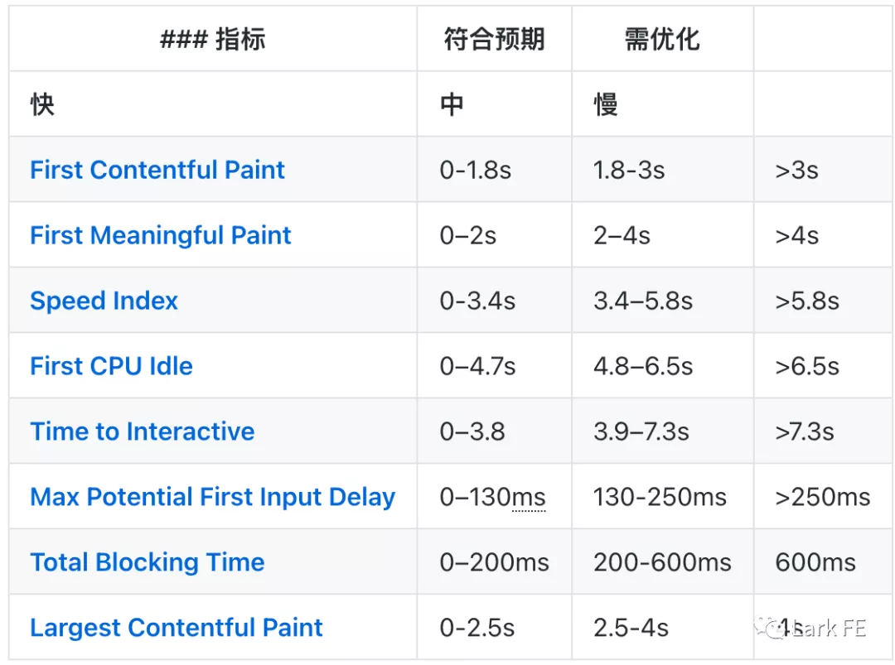
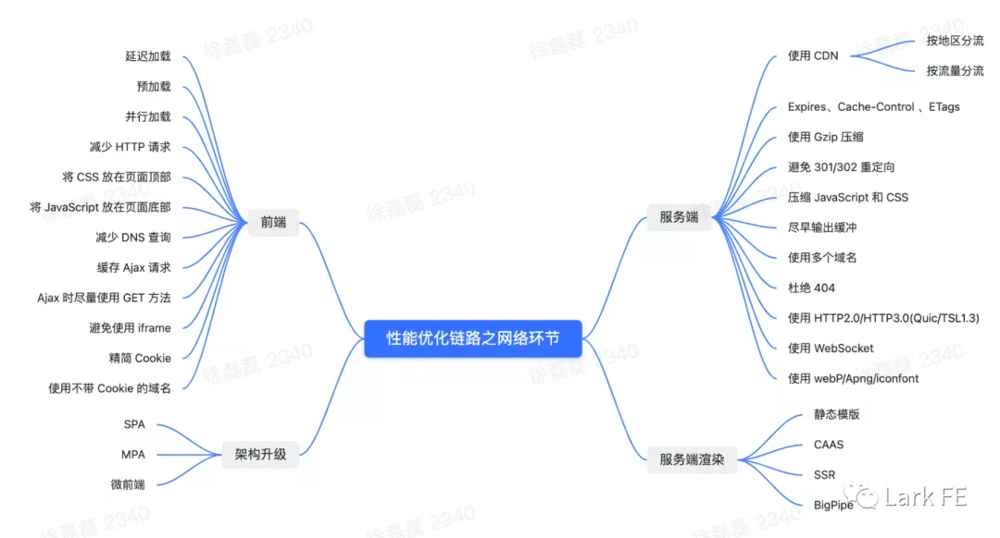
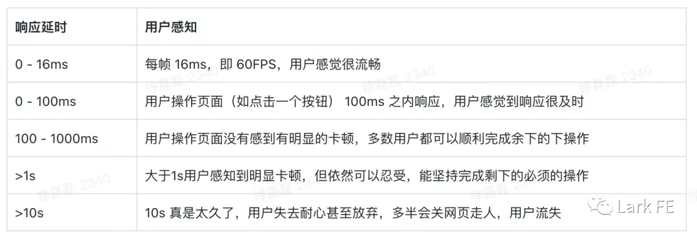
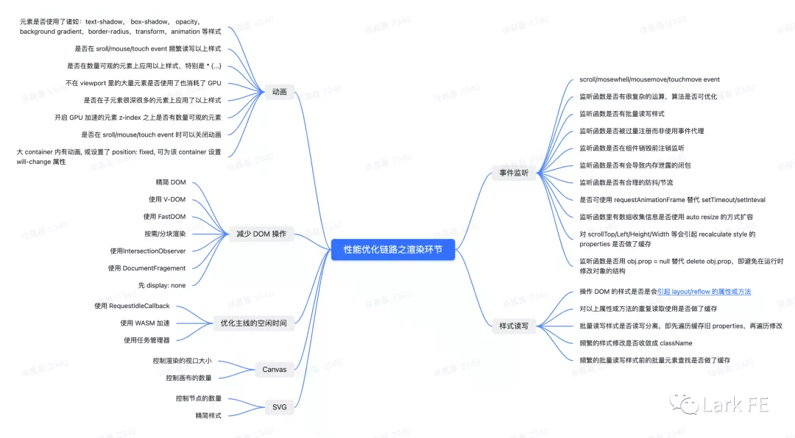

# 性能优化

[技术 MDN](https://web.dev/metrics/)

[web性能 MDN](https://developer.mozilla.org/zh-CN/docs/Web/Performance)

[web性能基础 MDN](https://developer.mozilla.org/zh-CN/docs/Learn/Performance/web_performance_basics)

[web性能工具 MDN](https://developer.mozilla.org/zh-CN/docs/Tools/Performance)

## 指标
[指标 MDN](https://web.dev/metrics/)

## Chrome DevTools

### Performance
[chrome performance](https://developers.google.com/web/tools/chrome-devtools/evaluate-performance?hl=zh-cn)

[peformance MDN](https://developer.mozilla.org/zh-TW/docs/Mozilla/Performance)

### Lighthouse

[使用 Lighthouse 审查网络应用](https://developers.google.com/web/tools/lighthouse/?utm_source=devtools)

### Memory

[解决内存问题](https://developers.google.com/web/tools/chrome-devtools/memory-problems?hl=zh-cn)

## 首屏优化指标
1. 图片懒加载
2. 适当尺寸的图片
3. 删除无用的javascript代码
4. 删除无用的css代码
5. 使用http/2
6. 缓存静态资源
7. 给图片设置宽高，减少累积偏移布局
8. 避免巨大的网络有效负载
9. 尽量减少dom的数量和深度
10. 减少主线程工作
11. 减少请求数量，减小传输体积
12. 尽量不使用内联js/css
13. 压缩js/css
14. 优化/压缩图片
15. css文件放在head,js文件放在body末尾
16. 避免多个页面重定向
17. 使用transform和opacity来实现动画

## 最佳实践
前端性能优化有很多维度，我们可以归类为几个环节：构建环节、网络环节、渲染环节、应用环节。

### 构建环节优化

### 网络环节优化

### 渲染环节优化

### 应用环节优化

**参考：**

[万字长文：分享前端性能优化知识体系](https://mp.weixin.qq.com/s/WUKrZ0dQzMg_C_cXvHPnxA)

[前端性能优化4大环节最佳实践与研发流程](https://mp.weixin.qq.com/s/FG0CTP6N7vF7UrLfhvGw5w)

